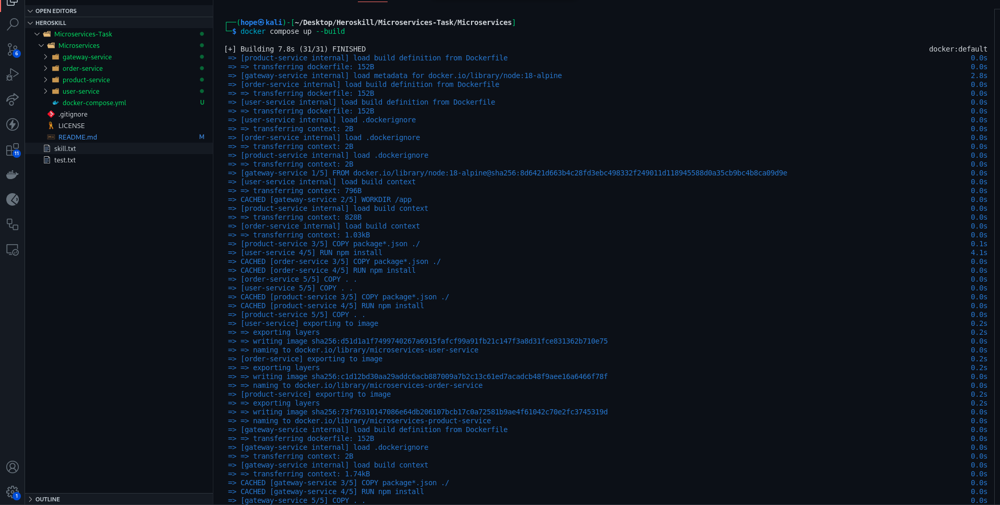
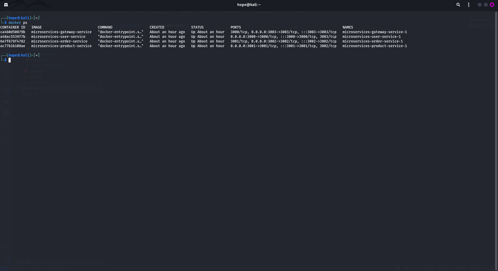
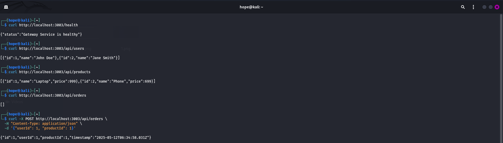

# Microservices Architecture

This repository demonstrates a basic microservices architecture using Node.js, Express, and Docker. It includes the following services:

- **User Service** – Manages users.
- **Product Service** – Manages product catalog.
- **Order Service** – Manages orders.
- **Gateway Service** – Acts as an API gateway aggregating responses from the above services.

## Project Structure

```
├── gateway-service
│   ├── app.js
│   ├── Dockerfile
│   └── package.json
├── user-service
│   ├── app.js
│   ├── Dockerfile
│   └── package.json
├── product-service
│   ├── app.js
│   ├── Dockerfile
│   └── package.json
├── order-service
│   ├── app.js
│   ├── Dockerfile
│   └── package.json
├── docker-compose.yml
└── README.md
```

## Getting Started

### Prerequisites

- Docker
- Docker Compose

### Run the Microservices

```bash
docker-compose up --build
```

### Health Check

```bash
curl http://localhost:3003/health
```

## API Endpoints

- `GET /api/users` → Fetch users
- `GET /api/products` → Fetch products
- `GET /api/orders` → Fetch orders
- `POST /api/orders` → Create a new order

## Screenshots

Screenshots should be hosted and linked here:

```md



```

## Dockerfile (Example - All Services Use Same Base)

```Dockerfile
FROM node:18-alpine
WORKDIR /app
COPY package*.json ./
RUN npm install
COPY . .
EXPOSE 3000
CMD ["node", "app.js"]
```

> Each service (user/product/order/gateway) uses its own `Dockerfile` with similar structure. Port is mapped as per the respective service.

## docker-compose.yml

```yaml
version: "3.8"

services:
  user-service:
    build: ./user-service
    ports:
      - "3000:3000"
    networks:
      - app-network

  product-service:
    build: ./product-service
    ports:
      - "3001:3001"
    networks:
      - app-network

  order-service:
    build: ./order-service
    ports:
      - "3002:3002"
    networks:
      - app-network

  gateway-service:
    build: ./gateway-service
    ports:
      - "3003:3003"
    depends_on:
      - user-service
      - product-service
      - order-service
    networks:
      - app-network

networks:
  app-network:
    driver: bridge
```
